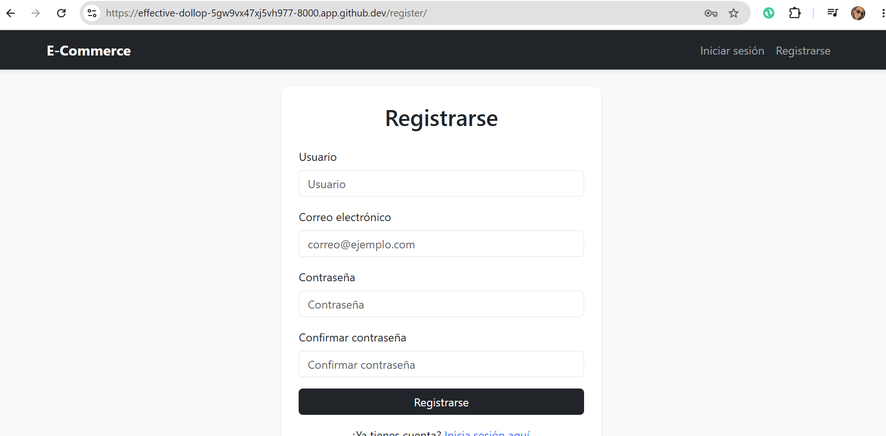
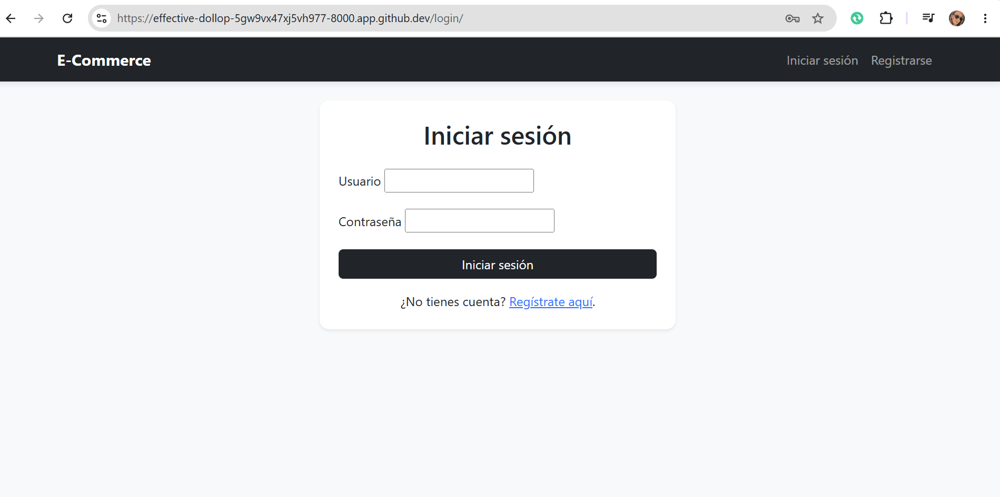
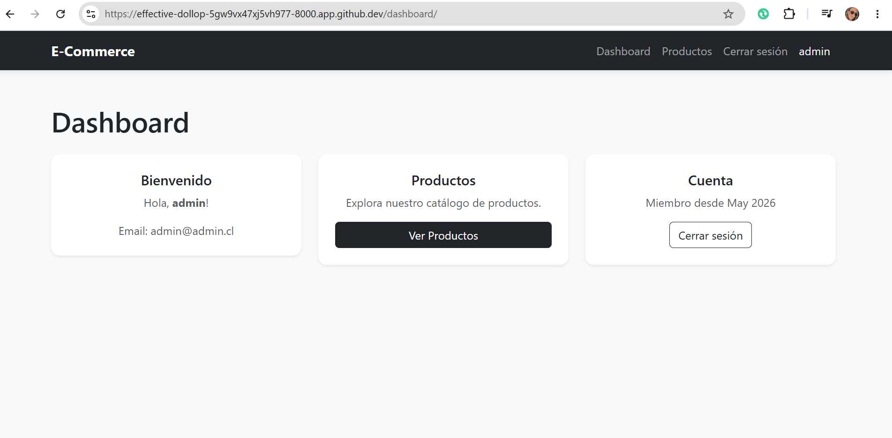

# E-Commerce MVP

Proyecto de comercio electrónico (E-commerce) desarrollado con Django siguiendo buenas prácticas profesionales.

## Pasos para ejecutar el proyecto

1.  Clonar el repositorio:
    ```bash
    git clone <repo-url>
    cd ecommerce_m6
    ```

2.  Crear y activar un entorno virtual:
    ```bash
    python3 -m venv .venv
    source .venv/bin/activate
    ```

3.  Instalar las dependencias:
    ```bash
    pip install -r requirements.txt
    ```

4.  Ejecutar las migraciones:
    ```bash
    python manage.py migrate
    ```

5.  Crear un superusuario (opcional, para acceder al admin):
    ```bash
    python manage.py createsuperuser
    ```

6.  Iniciar el servidor:
    ```bash
    python manage.py runserver
    ```

## Rutas principales

| Ruta         | Descripción              | Autenticación |
|--------------|--------------------------|---------------|
| `/register/` | Registro de usuario      | No            |
| `/login/`    | Iniciar sesión           | No            |
| `/dashboard/`| Dashboard del usuario    | Sí            |
| `/products/` | Catálogo de productos    | Sí            |
| `/logout/`   | Cerrar sesión            | No            |

## Usuario de prueba

Crear un usuario desde la línea de comandos:

```bash
python manage.py createsuperuser
```

O registrarse directamente desde la aplicación en `/register/`.

## Evidencia

### Registro de usuario



### Inicio de sesión



### Acceso a vista protegida (Dashboard)


